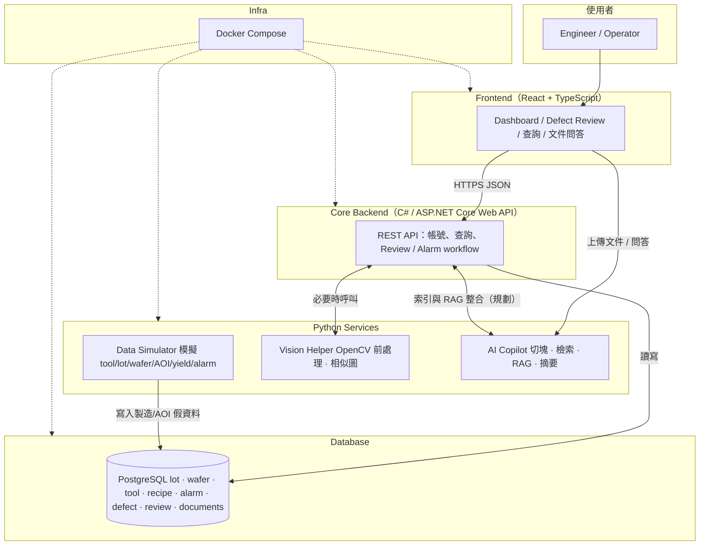
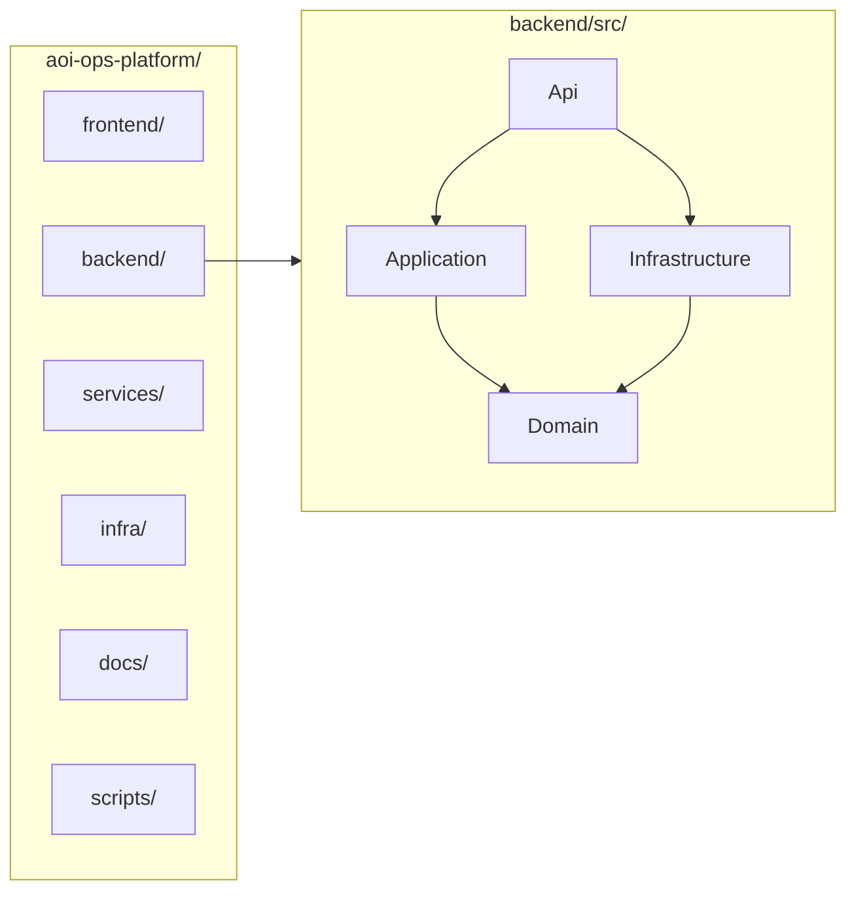
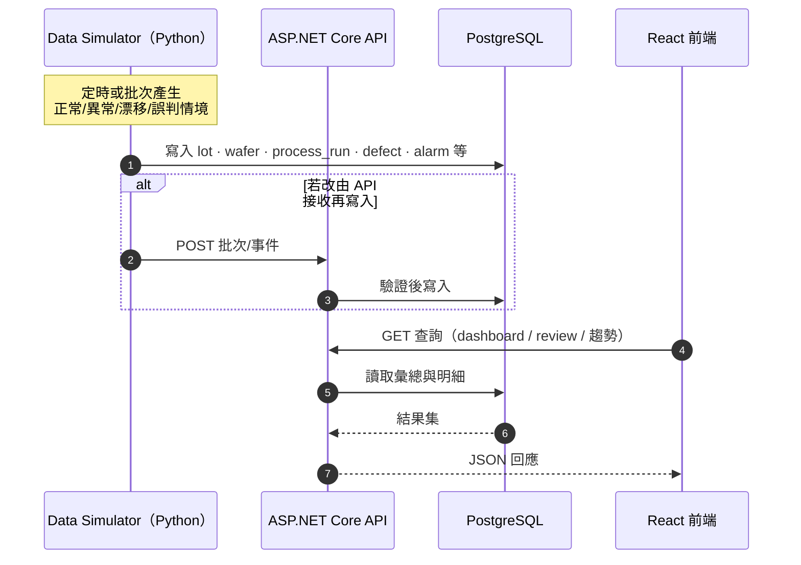
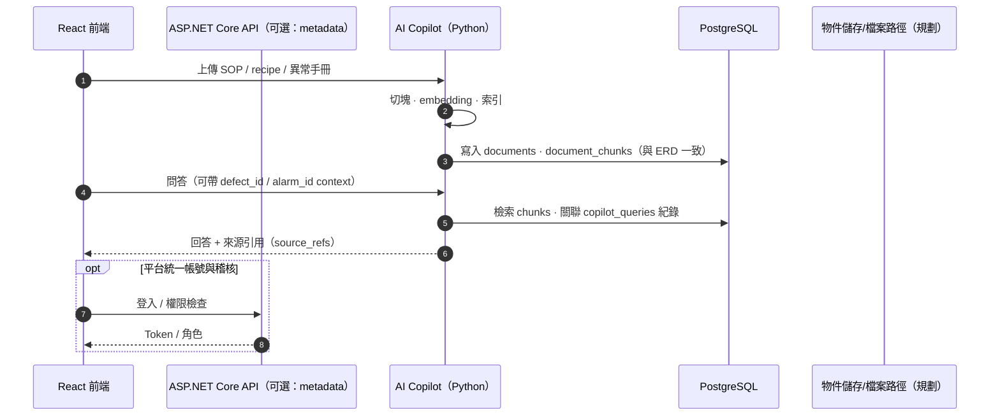
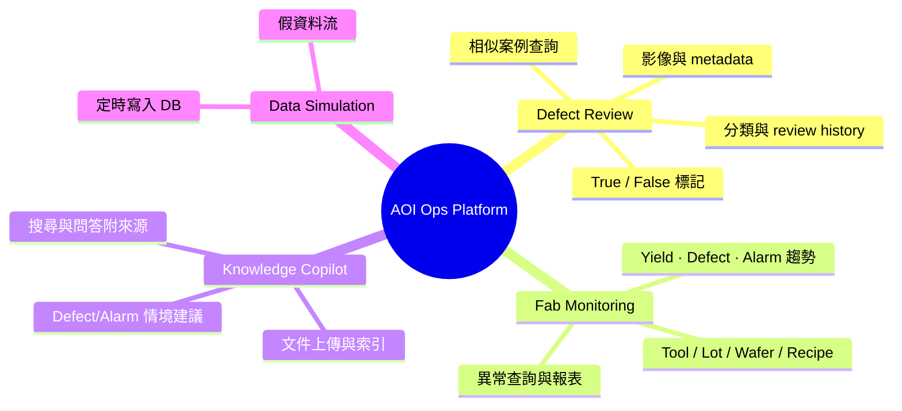
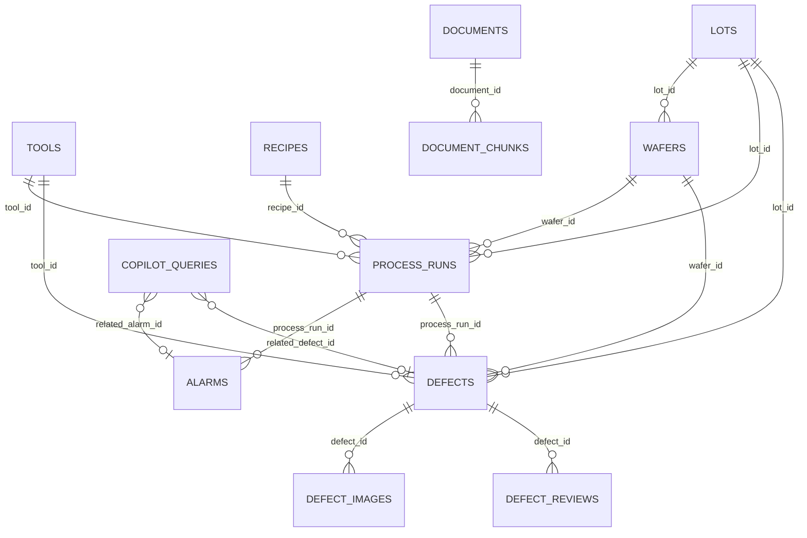

# AOI Ops Platform — 架構與資料流視覺化（Mermaid）

> **為什麼要有這份檔案**：把 `project.md`、`structrure.md`、`ERD.md` 裡的文字規格，濃縮成可一眼掃過的圖；之後規格變更時，只要改這裡對應的區塊即可持續迭代。  
> **如何更新**：新增模組時補「系統脈絡圖」的節點；API 或批次流程變更時改「資料流」sequence；資料表增刪時同步「ERD」區塊。圖與文字來源以根目錄 `project.md` / `structrure.md` / `ERD.md` 為準。

---

## 1. 系統脈絡（誰跟誰說話）

高階元件與責任分界；對齊 `project.md`「整體架構」。

**備註**：此圖以 PostgreSQL 為結構化資料庫；資料流方向與角色分工不因儲存引擎而改變。

---

## 2. Repo 目錄與後端分層（對齊 `structrure.md`）

**依賴方向（初學者記這句就好）**：`Api` 組裝一切；`Application` 寫用例流程；`Domain` 放業務模型與規則；`Infrastructure` 實作 DB、外部服務。**內層（Domain）不依賴外層**。

---

## 3. 主要資料流：模擬資料 → DB → 前端

對齊 `project.md`「資料流」前半段。

---

## 4. 資料流：文件上傳與 Copilot 問答

對齊 `project.md`「資料流」後半段與 Knowledge Copilot 模組。

---

## 5. 功能模組與資料領域（鳥瞰）

對齊 `project.md`「功能模組」。

---

## 6. 實體關係（ERD，對齊 `ERD.md`）

表名採 Mermaid `erDiagram` 慣例（大寫節點名僅為可讀性；實際 DB 命名以 migration 為準）。

> `copilot_queries` 與 `alarms` / `defects` 在 `ERD.md` 以欄位描述關聯；實作時請決定是否為可為 NULL 的外鍵，並與此圖同步更新。

---

## 7. 變更紀錄（建議每次改圖順手打一列）

| 日期 | 變更摘要 |
|------|----------|
| 2026-04-12 | 初版：依 `project.md`、`structrure.md`、`ERD.md` 建立脈絡、分層、資料流、ERD |
