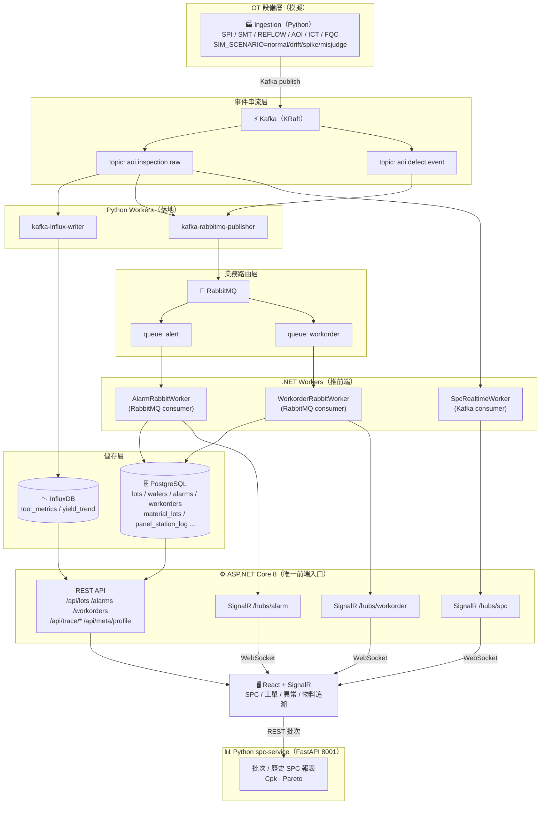
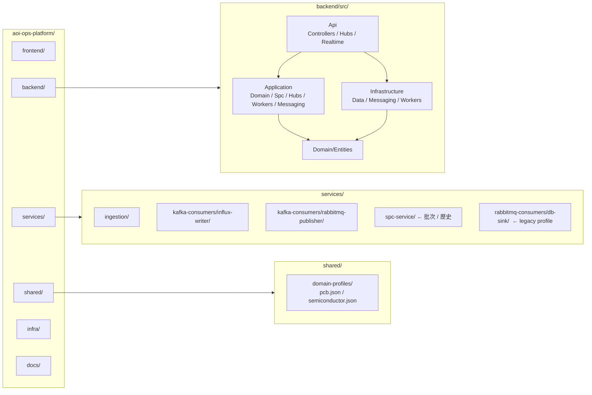
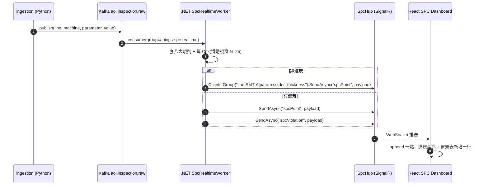
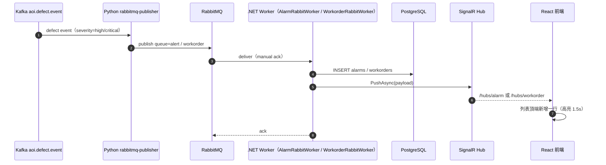
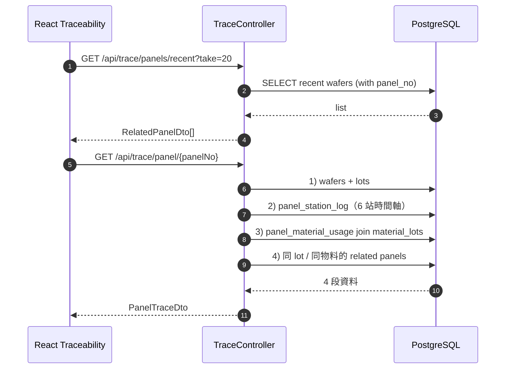
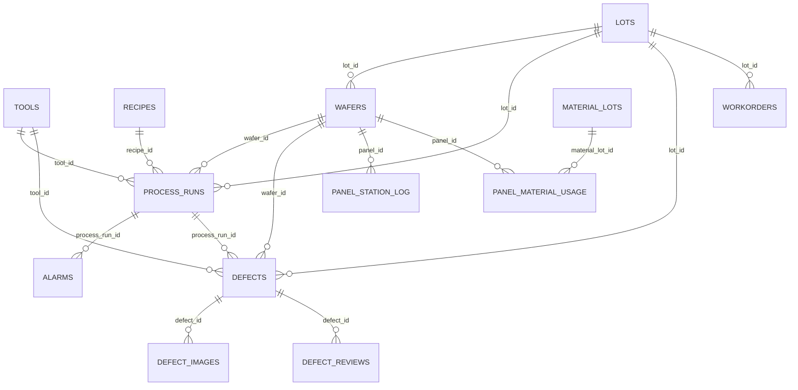

# AOI Ops Platform — 架構與資料流視覺化（Mermaid）

> **為什麼要有這份檔案**：把 `project.md`、`structrure.md`、`ERD.md` 裡的文字規格，濃縮成可一眼掃過的圖；
> 之後規格變更時，只要改這裡對應的區塊即可持續迭代。
>
> **2026-04 v2 重新對齊**：取消 MQTT / OPC-UA / Knowledge Copilot；
> SPC 改為 Kafka → .NET SignalR 即時推播；新增 4 個 SignalR Hub；
> 新增 Domain Profile 機制（pcb / semiconductor 同 codebase 切換）。

---

## 1. 系統脈絡（誰跟誰說話）

> 規則：
> - Kafka = 設備層 fan-out（多 consumer group 並行、可 replay）
> - RabbitMQ = 業務層分級路由 + ack（告警必處理 / 工單必建立）
> - **.NET 是前端唯一 SignalR push 入口**，Python 只負責落地（時序 / 業務寫入）

---

## 2. Repo 目錄與後端分層

依賴方向：`Api` 組裝一切；`Application` 寫用例與業務流程（不依賴 `Infrastructure`）；
`Domain` 放純資料模型；`Infrastructure` 實作 DB / Kafka / RabbitMQ。

---

## 3. SPC 即時推播 sequence

---

## 4. 業務事件 sequence（異常 / 工單）

---

## 5. 物料追溯查詢

---

## 6. ERD（PostgreSQL 部分，對齊 `ERD.md`）

> W08 新增三張表：`MATERIAL_LOTS` / `PANEL_MATERIAL_USAGE` / `PANEL_STATION_LOG`，
> `WAFERS` 加 `panel_no varchar UNIQUE`（對外可讀識別，例：`PCB-20240422-LOT-001-1`）。
>
> `DOCUMENTS` / `DOCUMENT_CHUNKS` / `COPILOT_QUERIES` 為舊版殘留，標 deprecated，未來會移除。

---

## 7. 變更紀錄

> 詳見根目錄 `log.md`。
