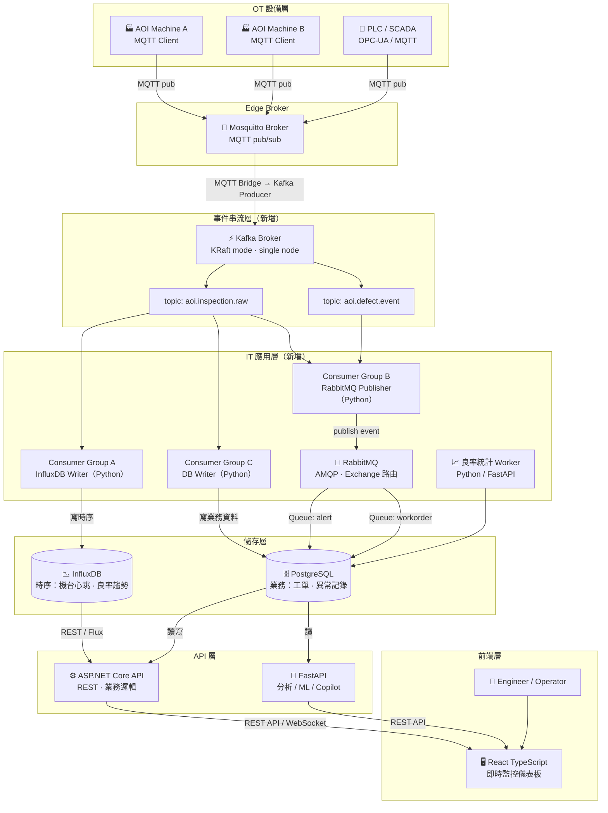
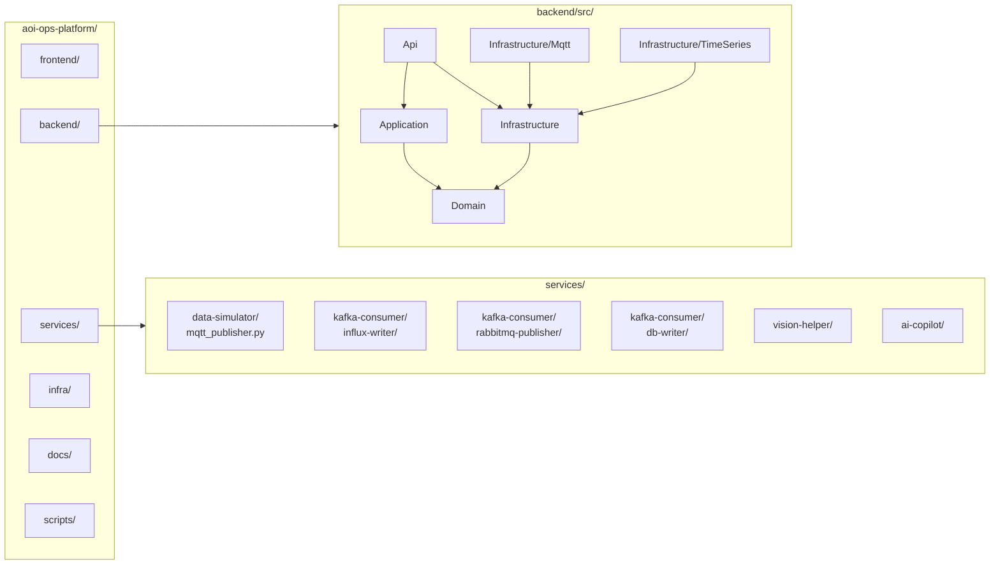
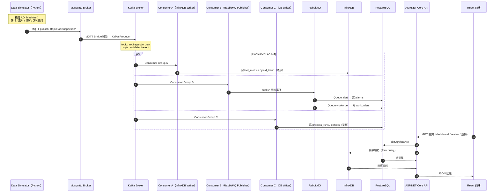
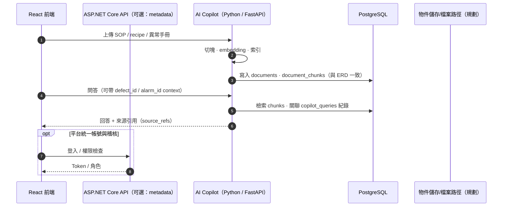
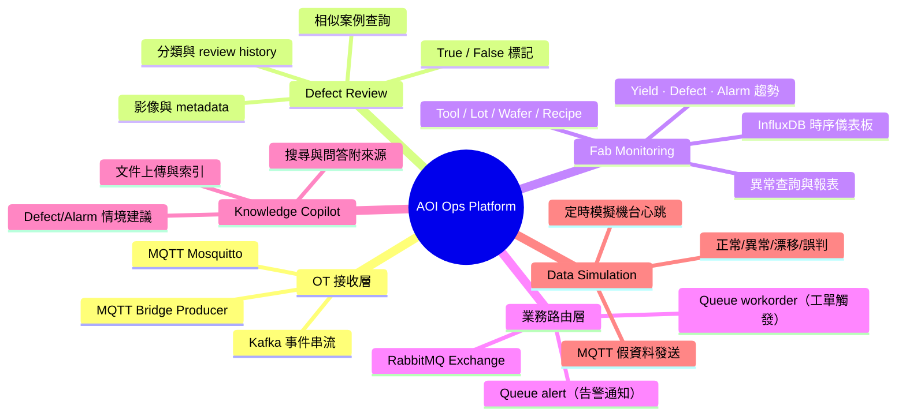
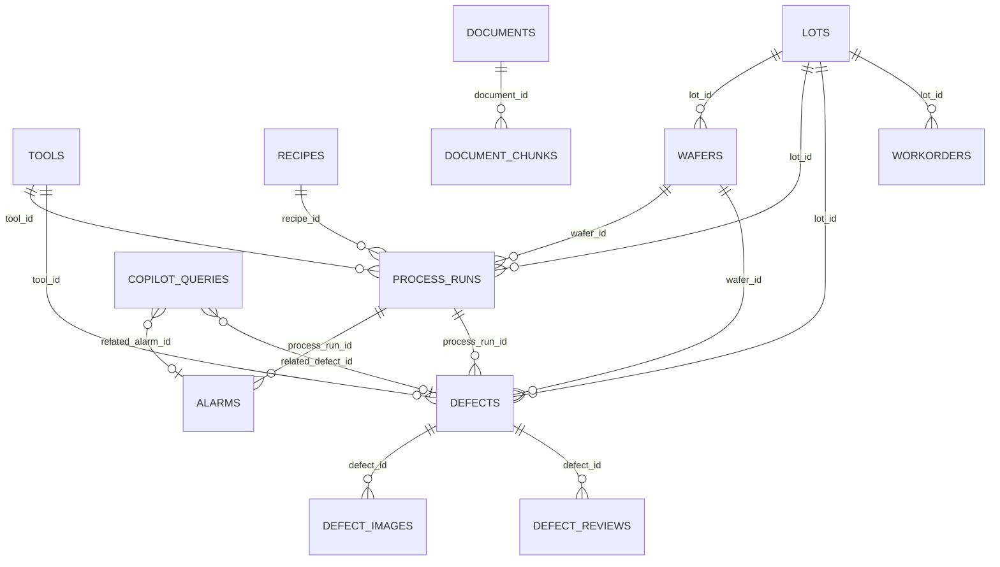

# AOI Ops Platform — 架構與資料流視覺化（Mermaid）

> **為什麼要有這份檔案**：把 `project.md`、`structrure.md`、`ERD.md` 裡的文字規格，濃縮成可一眼掃過的圖；之後規格變更時，只要改這裡對應的區塊即可持續迭代。  
> **如何更新**：新增模組時補「系統脈絡圖」的節點；API 或批次流程變更時改「資料流」sequence；資料表增刪時同步「ERD」區塊。圖與文字來源以根目錄 `project.md` / `structrure.md` / `ERD.md` 為準。

---

## 1. 系統脈絡（誰跟誰說話）

> 2026-04-24 更新：加入 Kafka 事件串流層、RabbitMQ 業務路由層、InfluxDB 時序儲存，對齊 HTML 架構設計圖。  
> **為什麼這樣設計**：OT 設備（AOI / PLC）只懂 MQTT，IT 系統需要可重播、可多消費者的事件流；Kafka 做兩者橋接，RabbitMQ 再做業務事件分級路由，讓「告警通知」與「工單觸發」職責分離、互不干擾。

---

## 2. Repo 目錄與後端分層（對齊 `structrure.md`）

**依賴方向（初學者記這句就好）**：`Api` 組裝一切；`Application` 寫用例流程；`Domain` 放業務模型與規則；`Infrastructure` 實作 DB、外部服務。**內層（Domain）不依賴外層**。

---

## 3. 主要資料流：OT 設備 → Kafka → 各消費者（新版）

> **為什麼改成這張圖**：原本「Simulator 直接寫 DB」的流程太簡單，無法反映真實工廠的 OT→IT 整合場景。加入 Kafka 後，你可以在履歷上說「設計過 MQTT Bridge → Kafka → 多消費者 fan-out 架構」，這是相當有說服力的設計經驗。

---

## 4. 資料流：文件上傳與 Copilot 問答

---

## 5. 功能模組與資料領域（鳥瞰）

---

## 6. 實體關係（ERD，PostgreSQL 部分，對齊 `ERD.md`）

表名採 Mermaid `erDiagram` 慣例（大寫節點名僅為可讀性；實際 DB 命名以 migration 為準）。

> **新增**：`WORKORDERS` 表承接 RabbitMQ `workorder` queue 的業務事件。`ALARMS.source` 欄位新增 `kafka` 來源識別，`DEFECTS.kafka_event_id` 對應 Kafka offset 追溯。

---

## 7. 變更紀錄

> 詳見根目錄 `log.md`（此 repo 習慣把 changelog 集中在一個檔案，避免每份文件都各寫一份而漂移）。

