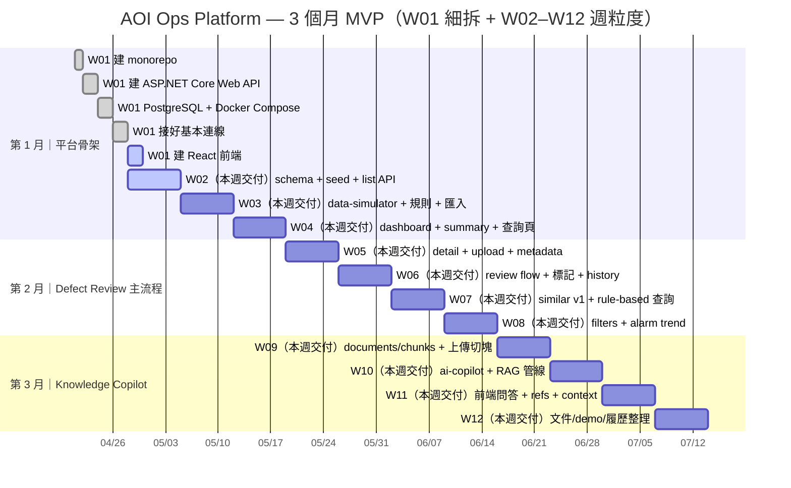

# Schedule 進度追蹤（✅=已完成 / ❌=未完成）

> **為什麼要有這份檔案**：把 `schedule.md` 的週次目標拆成可勾選的追蹤清單，讓你能快速看到「現在做到哪」。  
> **如何更新**：每完成一項就把行首的 `❌` 改成 `✅`；若項目範圍調整，請同步回頭更新 `schedule.md` 以免兩份文件漂移。  
> **甘特圖怎麼用**：下方 Mermaid `gantt` 以「週」為主時間粒度（W02 起每週一條），W01 則細拆成串接任務避免同一週內全部重疊顯示；當你更新上方清單 ✅/❌ 後，請同步調整甘特圖的 `done/active` 與日期區間，讓兩邊一致。

---

## 第 1 月｜目標：平台骨架跑起來

### 第 1 週
- ✅ 建 monorepo
- ❌ 建 React 前端
- ✅ 建 ASP.NET Core Web API
- ✅ 建 PostgreSQL + Docker Compose
- ✅ 接好基本連線

### 第 2 週
- ❌ 建 tools/lots/wafers/process_runs/alarms/defects schema
- ❌ 做 seed data
- ❌ 做 list API

### 第 3 週
- ❌ 做 Python data-simulator
- ❌ 定義假資料規則
- ❌ 寫入 DB 或透過 API 匯入

### 第 4 週
- ❌ 做 dashboard 首頁
- ❌ 顯示 yield、alarm、defect summary
- ❌ 做 lot / tool / defect 查詢頁

---

## 第 2 月｜目標：完成 AOI Defect Review 主流程

### 第 5 週
- ❌ defect detail 頁
- ❌ defect image upload
- ❌ defect metadata 顯示

### 第 6 週
- ❌ defect review flow
- ❌ true defect / false alarm 標記
- ❌ review history

### 第 7 週
- ❌ similar defect 功能第一版
- ❌ 先不用 ML，先做 rule-based 或 metadata 相似查詢

### 第 8 週
- ❌ dashboard 補 lot/tool/recipe filter
- ❌ 補 alarm list 與 basic trend chart

---

## 第 3 月｜目標：補 AI 文件助理，讓專案變完整

### 第 9 週
- ❌ 建 documents / document_chunks
- ❌ 做文件上傳與切塊

### 第 10 週
- ❌ 做 Python ai-copilot service
- ❌ 接 embedding / retrieval / answer generation

### 第 11 週
- ❌ 前端加 copilot 問答頁
- ❌ 顯示 source refs
- ❌ 支援帶 defect/alarm context 詢問

### 第 12 週
- ❌ 補 README、架構圖、假資料說明
- ❌ 錄 demo
- ❌ 整理履歷文案

---

## 甘特圖（Mermaid）

> **為什麼要加甘特圖**：清單適合「逐項勾選」，甘特圖適合「看時間軸與並行感」；兩者互補，追蹤會更直覺。  
> **注意**：這裡的起始日只是範例（方便一週=7 天對齊）；你實際開工日若不同，請改 `2026-04-21` 這個起點或各 task 的日期區間。

